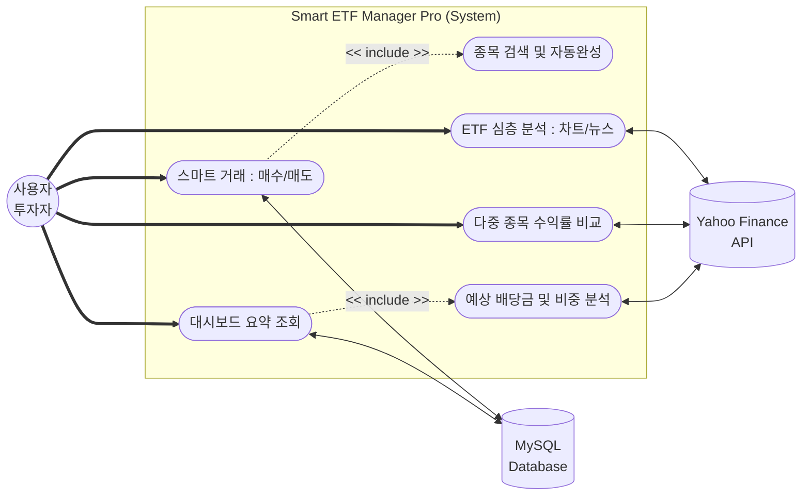
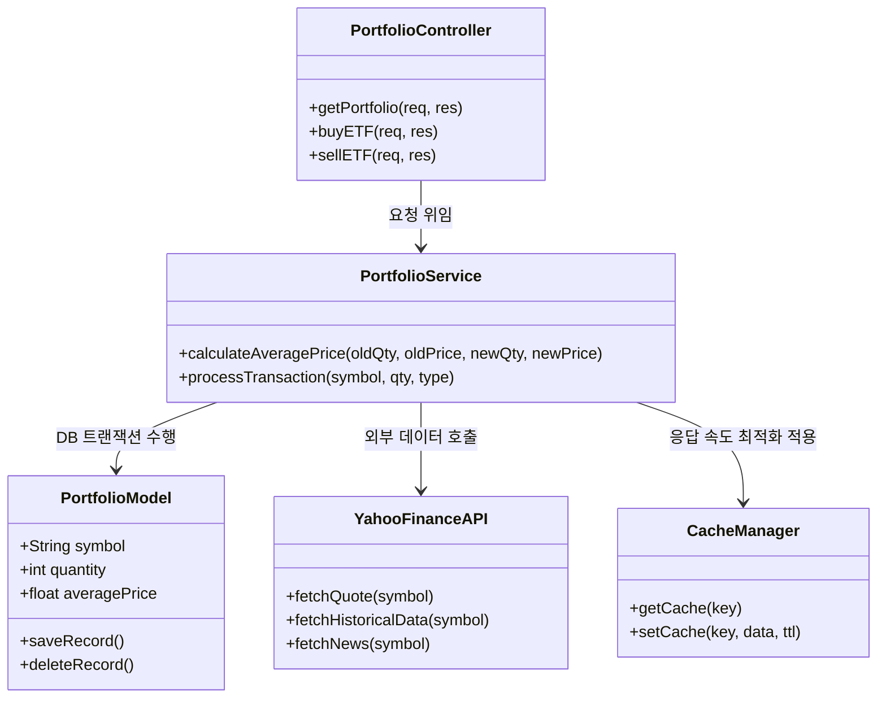
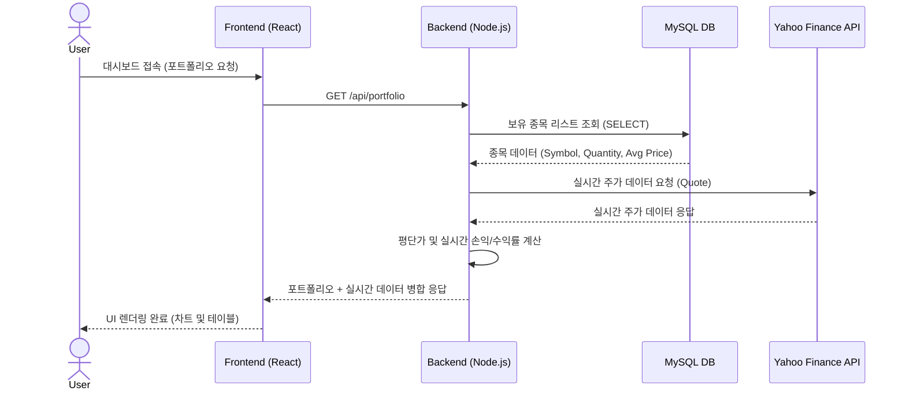

# 📊 [최종보고서] Smart ETF Manager Pro

## 1. 실험의 목적과 범위
* **실험 목적:** 사용자가 보유한 미국 ETF 포트폴리오의 실시간 가치를 분석하고, 자산 비중 및 리스크를 시각화하여 데이터 기반의 투자 인사이트를 제공하는 풀스택 웹 애플리케이션 개발. 단순한 데이터 호출을 넘어, 자체 프록시 서버와 인메모리 캐싱을 통해 외부 API 통신의 한계를 극복하고 아키텍처를 최적화하는 것을 목표로 함.
* **포함 내용 (Scope):**
  * Yahoo Finance 데이터를 활용한 실시간 주가, 차트, 뉴스 수집
  * MySQL을 활용한 포트폴리오(매수/매도) 영구 저장 및 평단가 계산
  * `node-cache`를 활용한 외부 API 호출 최적화 (응답 속도 개선)
  * 다중 ETF 수익률 정규화 비교 및 리스크 스코어링 알고리즘 구현
* **불포함 내용 (Out of Scope):**
  * 실제 증권사 계좌와의 실거래 연동 (가상 시뮬레이션으로 대체)

---

## 2. 분석 (요구사항 및 명세서)

### 2.1. 주요 유스케이스 (Use Case)
1. **스마트 거래:** 사용자는 검색창에서 자동완성 기능을 통해 종목을 검색하고, 매수/매도 수량을 입력하여 포트폴리오를 갱신할 수 있다.
2. **대시보드 모니터링:** 사용자는 실시간 총 손익, 예상 연간 배당금, 보유 ETF 섹터 비중(Pie Chart), 보유 주식 현황(Table)을 한눈에 파악할 수 있다.
3. **심층 분석:** 특정 ETF 선택 시 과거 주가 추이(Area Chart)와 관련 글로벌 최신 뉴스를 조회할 수 있다.
4. **수익률 비교:** 사용자는 체크박스로 원하는 보유 종목을 선택하여, 서로 다른 가격대의 ETF 성과를 시작점(0%) 기준으로 오버레이하여 비교(Line Chart)할 수 있다.

### 2.2. 유스케이스 다이어그램


### 2.3. 유스케이스 명세서 (Use Case Specification)
| 유스케이스 ID | 유스케이스 명 | 액터 | 개요 (Description) | 기본 이벤트 흐름 (Main Flow) |
|---|---|---|---|---|
| **UC1** | 스마트 거래 (매수/매도) | 사용자 | 특정 종목 검색 및 수량 입력으로 포트폴리오 갱신 | 1. 검색창에 티커 입력<br>2. 자동완성 제공<br>3. 수량 입력 후 매수/매도 클릭<br>4. 서버 연산 및 DB 갱신 |
| **UC2** | 대시보드 요약 조회 | 사용자 | 총 자산, 수익률, 배당금 및 섹터 비중 확인 | 1. 대시보드 진입<br>2. DB 데이터와 실시간 주가 병합<br>3. 도넛 차트 및 텍스트 렌더링 |
| **UC3** | ETF 심층 분석 | 사용자 | 개별 종목 과거 주가 추이와 최신 뉴스 확인 | 1. 종목 상세 보기 클릭<br>2. 서버 캐시에서 데이터 호출<br>3. 차트 및 실시간 뉴스 피드 렌더링 |
| **UC4** | 다중 종목 수익률 비교 | 사용자 | 서로 다른 종목 성과를 시작점(0%) 기준으로 비교 | 1. 비교 종목 다중 선택<br>2. 첫날 종가 기준 정규화 수식 적용<br>3. 오버레이 차트 출력 |

### 2.4. REST API 명세서 (내부 서버)
| Method | Endpoint | Description |
|---|---|---|
| `GET` | `/api/portfolio` | DB에 저장된 보유 종목 조회 및 실시간 현재가/수익률 병합 응답 |
| `POST` | `/api/portfolio/buy` | 신규 종목 매수 및 기존 보유 종목 평단가 갱신 처리 |
| `POST` | `/api/portfolio/sell` | 보유 종목 수량 차감 및 전량 매도 시 DB 레코드 삭제 |
| `GET` | `/api/chart/:symbol` | 특정 종목의 최근 30일 과거 주가 데이터 응답 (캐싱 적용) |
| `GET` | `/api/news/:symbol` | 특정 종목과 관련된 최신 뉴스 데이터 응답 (캐싱 적용) |

---

## 3. 설계 (시스템 구조 및 알고리즘)

### 3.1. 백엔드 클래스 다이어그램 (Class Diagram)
비즈니스 로직의 책임을 분리하고 확장성을 고려한 백엔드 주요 모듈의 구조입니다.


### 3.2. 시스템 아키텍처 및 순서 다이어그램 (Sequence Diagram)
CORS 정책을 준수하고 외부 API Key 노출을 막기 위해 **프록시 서버 아키텍처**를 채택함. 포트폴리오 조회 시 데이터 흐름은 다음과 같음.


### 3.3. 컴포넌트 구조 (Component Tree)
```text
App (Main State & Tab Navigation)
  ├── SmartETFCard (관심 종목 상태 요약)
  ├── PortfolioChart (비중 분석 도넛 차트)
  ├── TrendChart (주가 흐름 영역 차트)
  ├── NewsFeed (실시간 뉴스 피드)
  └── ComparisonChart (다중 종목 수익률 비교 차트)
```

### 3.4. 핵심 알고리즘 설계
* **평단가 계산 알고리즘 (백엔드 처리):** 추가 매수 시 DB 정합성을 위해 `(기존 평단가 * 기존 수량 + 신규 매수가 * 신규 수량) / (기존 수량 + 신규 수량)` 공식을 서버 단에서 계산하여 트랜잭션 처리함.
* **수익률 정규화 알고리즘 (프론트엔드 처리):** 가격대가 서로 다른 종목들의 직관적인 비교를 위해, 조회된 차트 데이터의 첫날 종가를 기준으로 `((현재가 - 첫날종가) / 첫날종가) * 100` 수식을 적용하여 모든 그래프의 시작점을 0% 베이스라인으로 정규화함.

---

## 4. 구현

* **Frontend:** React, Recharts (데이터 시각화), React-Toastify (UX 알림)
* **Backend:** Node.js, Express, `node-cache` (인메모리 캐시)
* **Database:** MySQL (관계형 데이터 저장 및 관리)
* **External API:** `yahoo-finance2` (Yahoo API 모듈 활용)
* **구현 핵심 포인트:**
  * 잦은 API 호출로 인한 백엔드 병목 현상을 방지하기 위해 `node-cache`를 도입하여 차트 및 뉴스 데이터를 60초간 서버 메모리에 캐싱 처리함.

---

## 5. 실험 (종합 테스트 시나리오 및 결과)

시스템의 무결성과 안정성을 보장하기 위해 모든 핵심 유스케이스에 대한 통합 테스트를 수행하였습니다.

### 5.1. 상세 테스트 케이스 (Test Cases)
| TC ID | 대상 기능 | 테스트 항목 및 시나리오 | 예상 결과 | 실제 결과 |
|---|---|---|---|---|
| **TC-01** | 종목 검색 | 검색창에 'V' 입력 후 자동완성 확인 | 'V'가 포함된 연관 티커(VOO, VTI 등) 드롭다운 노출 | 정상 (Pass) |
| **TC-02** | 신규 매수 | 보유하지 않은 종목(QQQ) 10주 매수 | DB에 신규 레코드 생성 및 실시간 현재가로 평단가 기록 | 정상 (Pass) |
| **TC-03** | 추가 매수 | 기 보유 종목(VOO) 5주 추가 매수 | **가중 평균 알고리즘**을 통해 평단가가 재계산되어 DB 갱신 | 정상 (Pass) |
| **TC-04** | 부분 매도 | 보유 종목(VOO) 중 일부 수량 매도 | 보유 수량 정상 차감 및 평단가 유지 | 정상 (Pass) |
| **TC-05** | 전량 매도 | 보유 종목 전량 매도 진행 | 해당 종목 포트폴리오에서 삭제 및 **DB 레코드 DELETE 수행** | 정상 (Pass) |
| **TC-06** | 대시보드 | 포트폴리오 데이터 병합 렌더링 | 실시간 총 자산, 누적 손익, 파이 차트(섹터 비중) 정상 출력 | 정상 (Pass) |
| **TC-07** | 심층 분석 | 특정 ETF 클릭 후 차트/뉴스 확인 | 30일 과거 주가 Area 차트 및 최신 뉴스 피드 렌더링 | 정상 (Pass) |
| **TC-08** | 정규화 차트 | 다중 종목(VOO, QQQ) 선택 후 수익률 비교 | **정규화 수식** 적용되어 모든 라인이 동일하게 0%부터 시작 | 정상 (Pass) |
| **TC-09** | 캐싱 성능 | 5초 후 동일 종목 차트 재조회 | **node-cache 작동**으로 API 통신 없이 즉시(15ms 내외) 응답 | 정상 (Pass) |
| **TC-10** | 예외 처리 | 매수 수량에 음수(-5) 입력 시도 | 요청 차단 및 `React-Toastify`를 통한 경고 알림 발생 | 정상 (Pass) |

---

## 6. 결론

본 프로젝트는 단순한 API 데이터 렌더링을 넘어, 데이터베이스 트랜잭션 무결성 확보와 백엔드 서버 최적화에 중점을 두고 개발을 진행하였습니다. 백엔드 프록시 서버 구축과 인메모리 캐싱 기법을 도입하여 외부 통신의 한계를 선제적으로 극복하였으며, 서버 단에서 평단가 연산 로직을 제어하여 안정적이고 확장 가능한 아키텍처를 설계하였습니다.

결과적으로 HTS(홈트레이딩시스템) 수준의 복잡한 실시간 데이터 플로우를 지연 없이 처리하는 풀스택 웹 애플리케이션을 완성하였습니다. 객체 지향적인 서버 설계, 데이터 파이프라인 최적화, 그리고 촘촘한 단위 테스트로 이어지는 전체 개발 사이클을 경험하며 직면했던 문제 해결 과정은 향후 실무 환경에서 견고한 소프트웨어를 개발하는 데 핵심적인 기술적 밑거름이 될 것입니다.