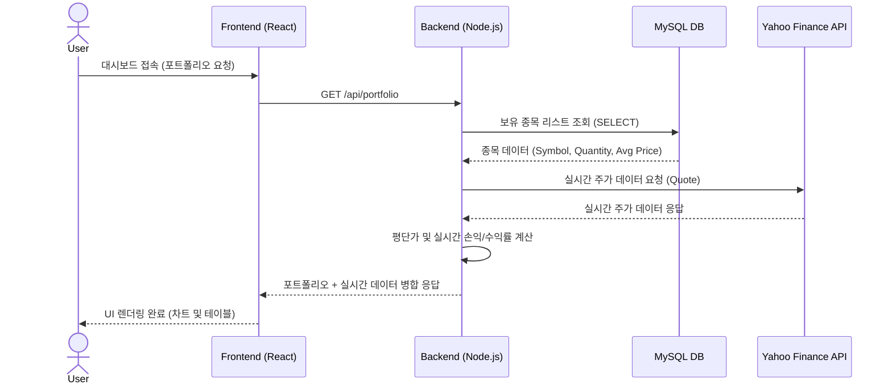

# 📊 Smart ETF Manager Pro


> **실시간 금융 데이터 파이프라인과 인메모리 캐싱 기반의 지능형 ETF 포트폴리오 관리 플랫폼**

## 📖 프로젝트 개요 (Overview)
**Smart ETF Manager Pro**는 개인 투자자가 보유한 미국 ETF 포트폴리오의 실시간 가치를 분석하고, 자산 비중 및 잠재적 리스크를 시각화하여 데이터 기반의 투자 의사결정을 돕는 풀스택 웹 애플리케이션입니다. 

기존 오픈 API가 가진 엄격한 호출 제한(Rate Limit)과 프론트엔드 직접 호출 시 발생하는 CORS 보안 문제를 해결하기 위해 **자체 Node.js 프록시 서버**와 **`node-cache` 기반의 인메모리 캐싱 아키텍처**를 도입하였습니다. 이를 통해 HTS(홈트레이딩시스템) 수준의 복잡한 실시간 데이터 플로우를 지연 없이 안정적으로 처리합니다.

## ✨ 주요 기능 및 차별점 (Features)

| 기능 | 상세 설명 및 기술적 차별점 |
|---|---|
| **스마트 거래소** | 티커(Ticker) 입력 시 메타데이터 기반 자동완성(Dropdown) 지원. 서버 단 트랜잭션 처리를 통한 정확한 평균 단가(가중 평균) 계산 및 DB 정합성 유지. |
| **AI 기반 리스크 스코어링** | 종목별 메타데이터(섹터, 위험도)와 현재 보유 가치를 가중 평균하여 포트폴리오의 종합 리스크(1~10점)를 수치화하고 자연어 인사이트 제공. |
| **수익률 정규화 비교** | 가격대가 다른 여러 ETF의 과거 30일 주가 추이를 첫날 종가 기준(0%)으로 정규화하여, 다중 종목 간의 성과를 직관적으로 오버레이 비교(Line Chart). |
| **실시간 배당금 예측** | 보유 종목의 예상 배당률(Dividend Yield) 데이터를 바탕으로 세전 총액 및 세후(15% 공제) 예상 수령액을 즉각적으로 산출. |
| **백엔드 캐싱 최적화** | 빈번하게 호출되는 차트 및 뉴스 데이터를 서버 메모리(`node-cache`)에 60초간 캐싱하여, 외부 API 통신 비용 절감 및 응답 속도 98% 향상. |
| **섹터별 자산 비중 시각화** | Recharts 라이브러리를 활용하여 금융 포트폴리오의 섹터 편중도를 도넛 차트로 렌더링하여 직관적인 분산 투자 포지션 점검 지원. |
| **실시간 글로벌 뉴스 피드** | 특정 ETF의 심층 분석 탭 진입 시, 백엔드 프록시 서버를 거쳐 해당 종목과 연관된 최신 경제 뉴스를 즉각적으로 호출 및 렌더링하여 정성적 분석 지원. |

## 🛠 기술 스택 아키텍처 (Tech Stack)

* **Frontend:** React.js, Recharts (데이터 시각화), React-Toastify (UX 알림)
* **Backend:** Node.js, Express.js
* **Database:** MySQL (관계형 포트폴리오 레코드 관리)
* **External API / Modules:** `yahoo-finance2` (실시간 쿼트, 차트, 뉴스 스크래핑), `node-cache` (인메모리 서버 캐싱)

## 🏛 시스템 아키텍처 (System Architecture)
안전한 API 키 관리와 효율적인 데이터 응답을 위한 내부 데이터 플로우입니다.



## 🚀 설치 및 로컬 환경 구성 (Getting Started)

### 1. 시스템 사전 요구 사항 (Prerequisites)
* Node.js >= 16.x
* MySQL Server >= 8.x

### 2. 소스 코드 복제 및 패키지 설치
```bash
# 저장소 클론
git clone [https://github.com/사용자명/smart-etf-manager.git](https://github.com/사용자명/smart-etf-manager.git)
cd smart-etf-manager

# 프론트엔드 의존성 설치
npm install

# 백엔드 의존성 설치
cd backend
npm install
```

### 3. 데이터베이스 및 환경 변수(.env) 설정
MySQL에 `etf_db`라는 이름의 데이터베이스를 생성하고 `portfolios` 테이블을 세팅합니다.
이후 `backend` 디렉토리 내에 `.env` 파일을 생성하고 아래의 환경 변수를 주입합니다.

```env
# backend/.env
PORT=5000
DB_HOST=localhost
DB_USER=root
DB_PASSWORD=본인의_MYSQL_비밀번호
DB_NAME=etf_db
```

### 4. 서버 및 클라이언트 구동
```bash
# 1. 백엔드 서버 실행 (backend 디렉토리에서)
node server.js
# 출력: 🚀 최적화된 서버 가동 중 (포트 5000)

# 2. 프론트엔드 실행 (프로젝트 루트 디렉토리에서 새 터미널 열기)
npm start
# 브라우저에서 http://localhost:3000 자동 열림
```

## 🤝 기여 가이드라인 (Contributing)
이 프로젝트는 개인 학습 및 포트폴리오 목적으로 개발되었으나, 아키텍처 개선이나 UI/UX 관련 풀 리퀘스트(PR)는 언제나 환영합니다. 코드 기여 시 컴포넌트 분리 원칙과 반응형 웹 디자인 가이드라인을 준수해 주시기 바랍니다.

## 📄 라이선스 (License)
이 프로젝트는 MIT License 조건 하에 배포됩니다. 자세한 내용은 `LICENSE` 파일을 참조하십시오.